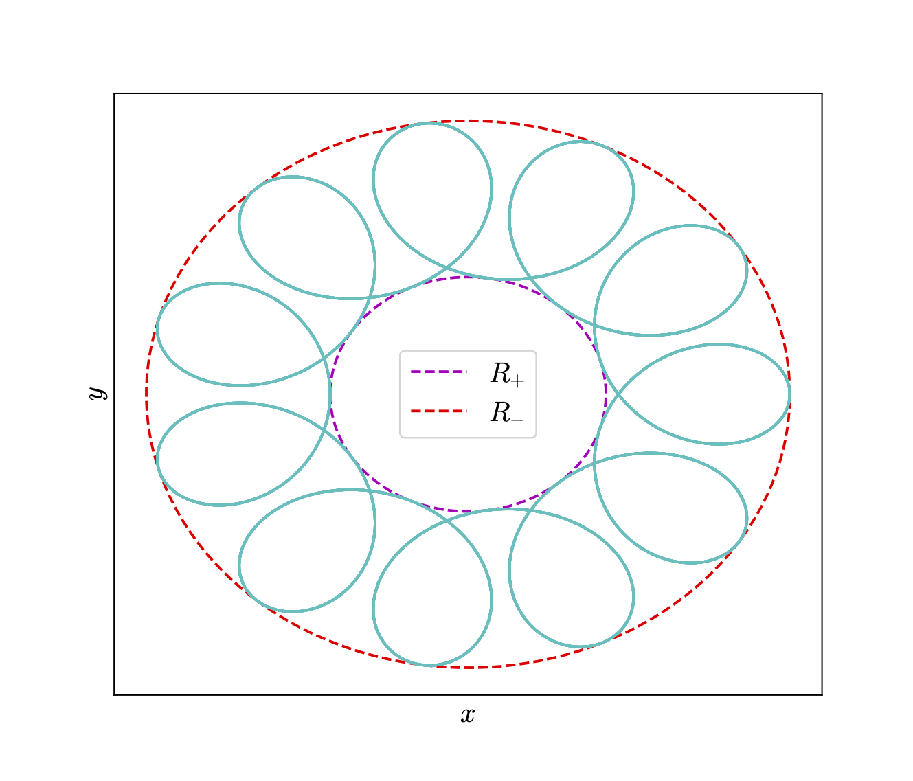
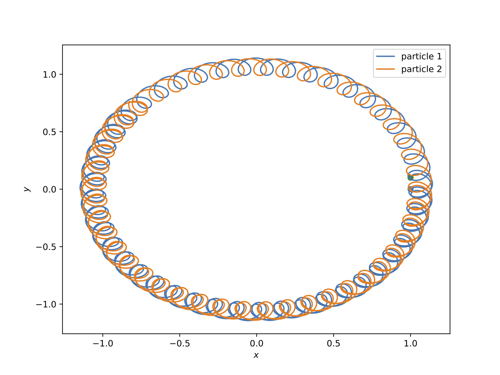

# Simulating The Penning Trap

 

## Abstract

The aim of this report is to study an idealized version of a device called Penning trap. It is used
by scientists all over the world to investigate charged particles by trapping them long enough to
gather data. We simulate singly charged $Ca+$ ions and explore how the ions interact with each other
inside the trap. In addition, we will analyse two different numerical methods and figure out which
one is best suited to perform the simulations.

## Authors

- Sophus B Gullbekk (sophusbg@math.uio.no)
- Tov Uberg Tyvold (tovut@math.uio.no)
- Erlend Kristensen (erlek@math.uio.no)
- Jonathan Larsen (jonathel@math.uio.no) 

_________________________

When the <code>Makefile</code> is ran, the file <code>plot.py</code> can plot the results written to text files.

_________________________

We utilized <code>utilities.cpp</code> for writing data regarding the 3D-plots with a header file <code>utilities.hpp</code> for linking.

_________________________

We also made a <code>test_analytical.py</code> file for testing our methods and implementation.

## Figures
All the figures that we have produced and put in our paper are located here.

## Latex
This folder contains the <code>.tex</code> and <code>.pdf</code> file along with the auxiliary files that latex needs.

 
